# Design Document: Appwrite Base Classes

## Overview

Dokumen ini mendeskripsikan desain teknis untuk base class Appwrite di shared library `kanzankazuLibs`. Desain mengikuti pola yang sudah ada di codebase Supabase (interface + impl, `BaseResponse<T>`, suspend + Flow) dan menyediakan abstraksi lengkap untuk Appwrite Android SDK (`io.appwrite:sdk-for-android`).

Semua base class menggunakan `BaseResponse<T>` sealed interface yang sudah ada (`Loading`, `Empty`, `Error`, `Success<T>`) untuk konsistensi dengan Supabase pattern yang sudah ada.

### Perbedaan Utama dengan Supabase

1. **Context-dependent initialization** — Appwrite `Client` membutuhkan Android `Context`, berbeda dengan Supabase yang hanya butuh URL + key
2. **Service objects** — Appwrite menggunakan service objects terpisah (`Account`, `Databases`, `Storage`, `Realtime`, `Functions`), bukan plugin/module install
3. **Database model** — Appwrite menggunakan `databaseId` + `collectionId` + `documentId`, bukan table name langsung
4. **Storage model** — Appwrite menggunakan `bucketId` + `fileId`, bukan bucket + path
5. **Query API** — Appwrite menggunakan `Query` class dengan static methods, bukan Postgrest filter builder
6. **Realtime** — Appwrite menggunakan callback-based `realtime.subscribe()`, bukan channel-based WebSocket
7. **No serialization plugin** — Appwrite SDK mengembalikan `Document` objects dengan `data: Map<String, Any>`, bukan JSON deserialization otomatis

### Key Design Decisions

1. **Singleton AppwriteClientProvider** — Mengikuti pola `SupabaseClientProvider` dengan tambahan `Context` parameter
2. **Interface + Impl pattern** — Konsisten dengan `SupabaseDatabase`/`SupabaseDatabaseImpl` untuk testability
3. **Reuse BaseResponse<T>** — Langsung pakai yang sudah ada di `kanzanbaseresponse`
4. **Map-based data** — Appwrite Database menggunakan `Map<String, Any>` untuk document data, bukan serialized objects
5. **Gson deserialization** — Untuk `*WithType` methods, menggunakan Gson (sudah ada di project) untuk convert Map ke typed objects

## Architecture Per Feature

### 1. Configuration & Client Initialization

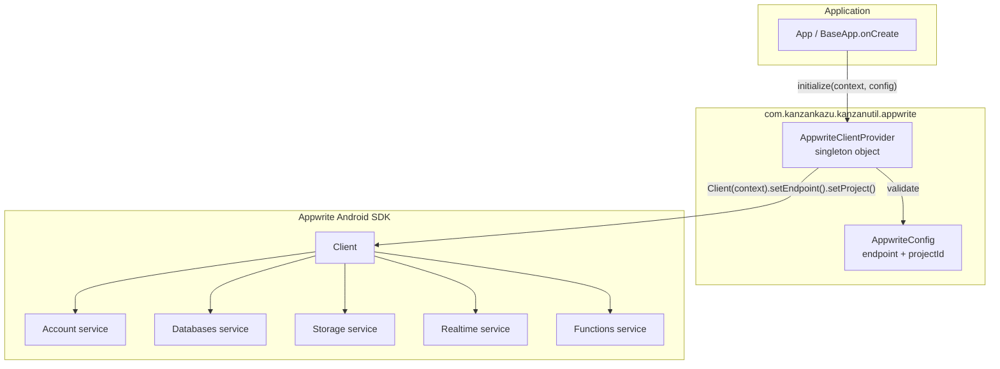

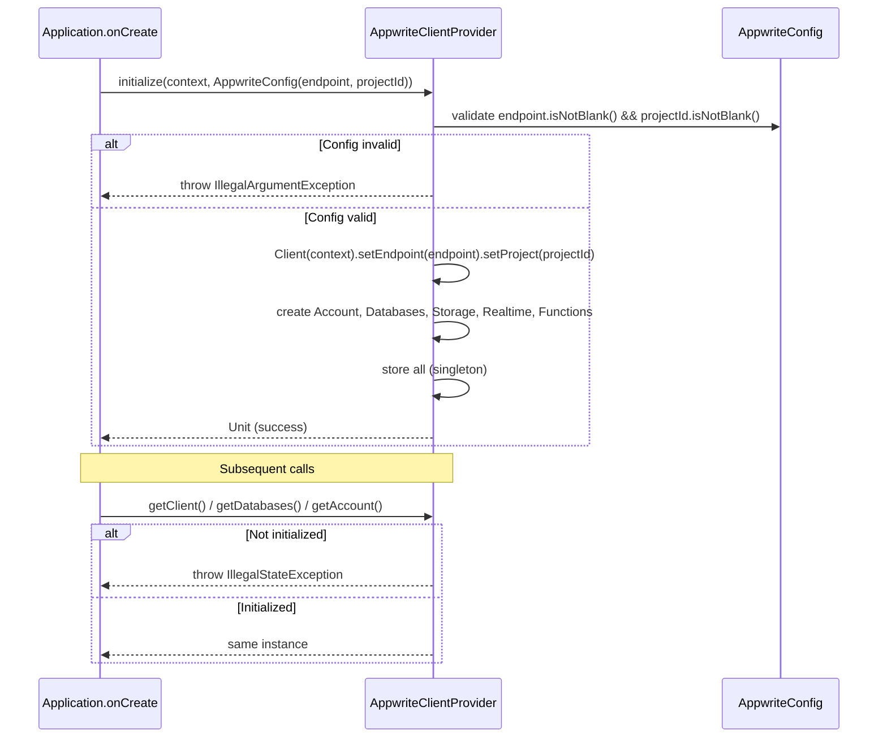

### 2. Database

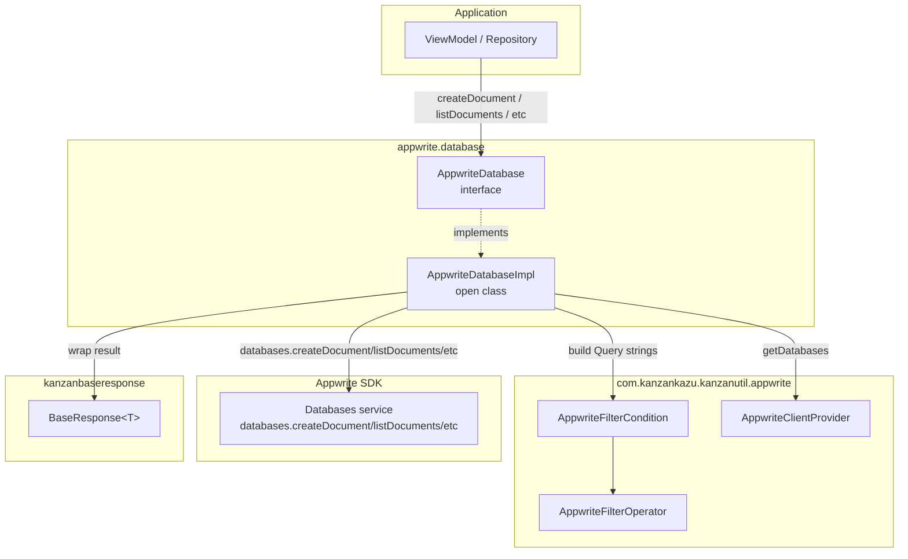

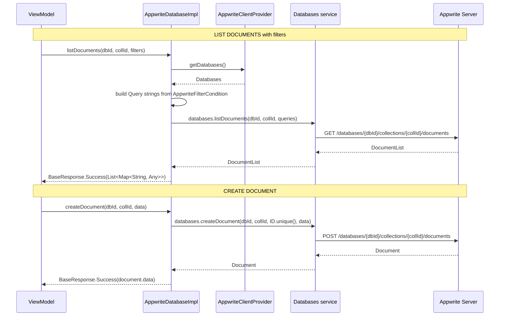

### 3. Authentication

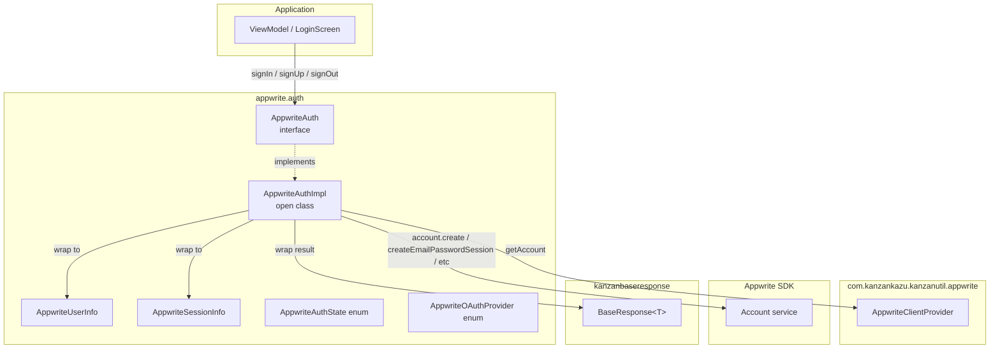

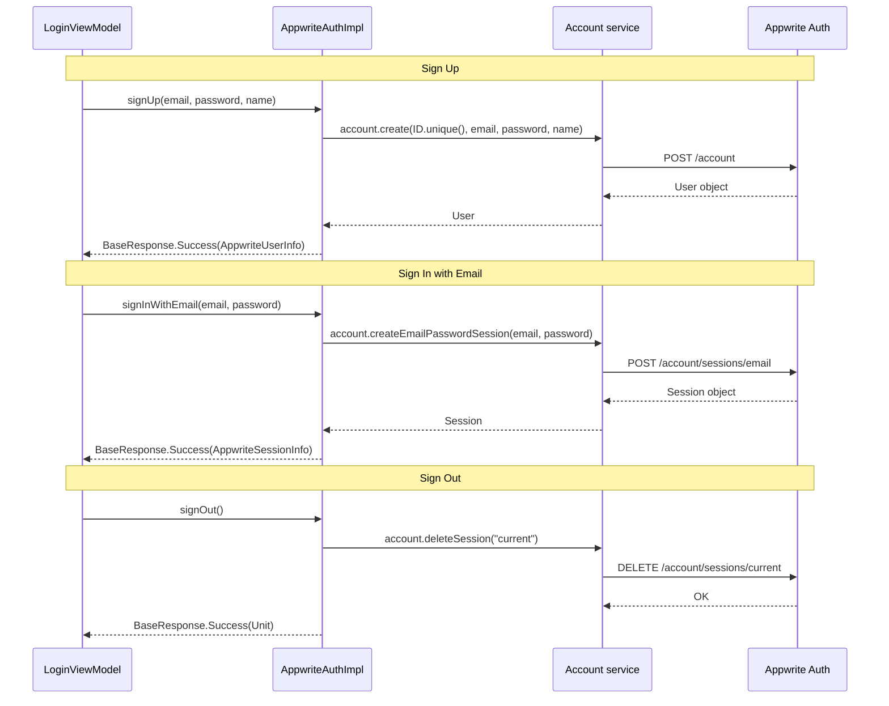

### 4. Storage

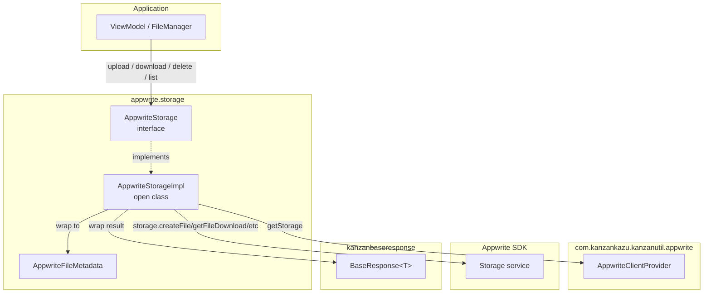

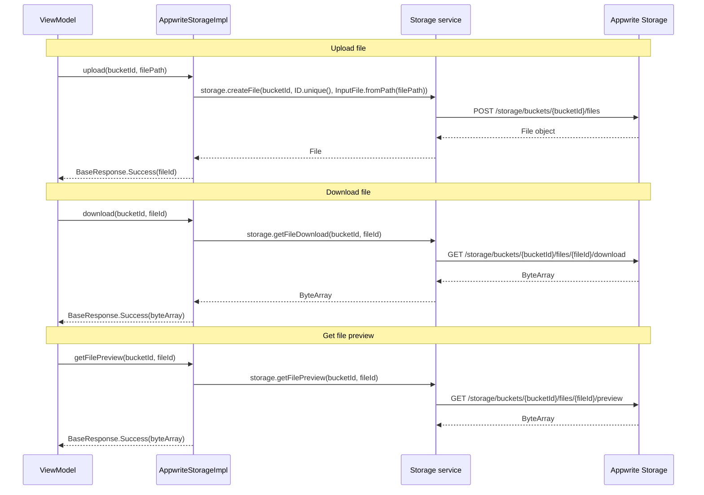

### 5. Realtime

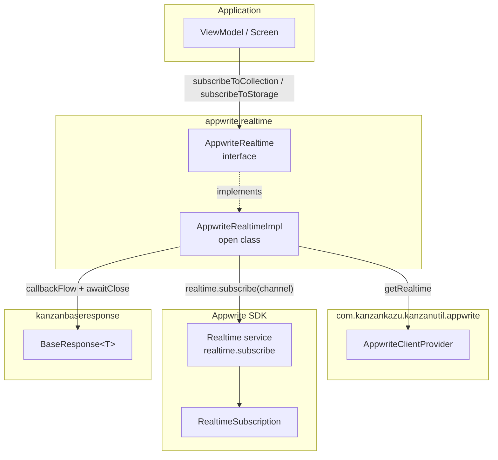

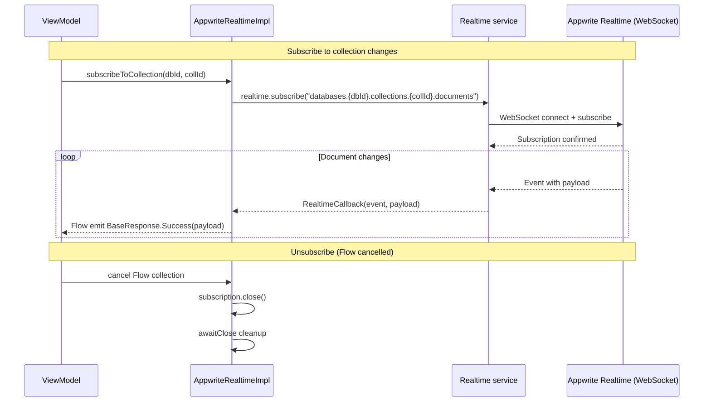

### 6. Functions

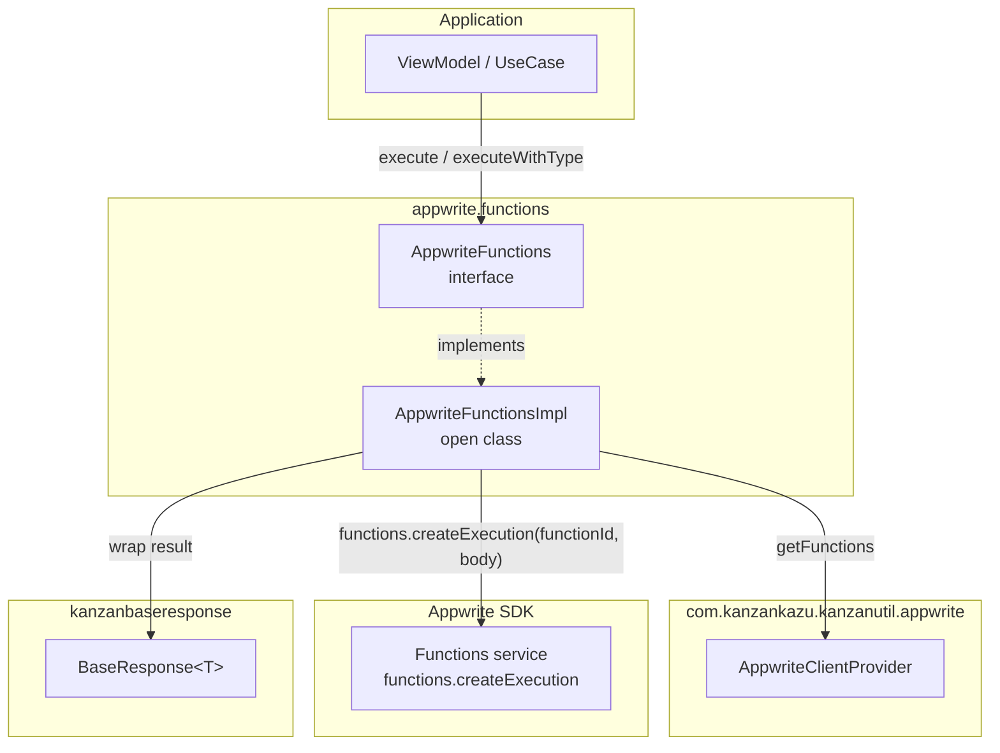

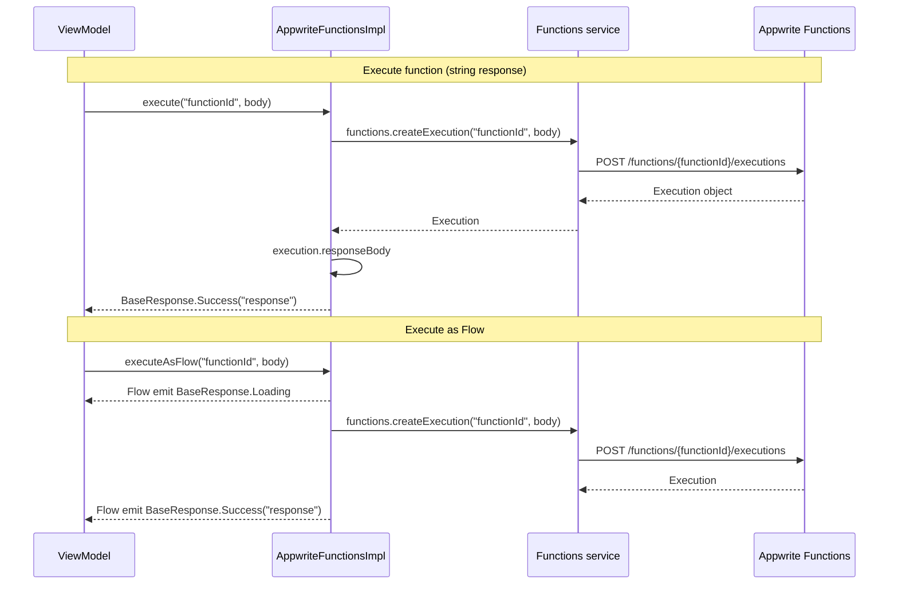

## Components and Interfaces

### 1. AppwriteConfig

Data class untuk menyimpan konfigurasi koneksi Appwrite.

```kotlin
data class AppwriteConfig(
    val endpoint: String,
    val projectId: String
)
```

### 2. AppwriteClientProvider

Singleton object yang mengelola lifecycle Appwrite `Client` dan service objects. Membutuhkan `Context` untuk inisialisasi.

```kotlin
object AppwriteClientProvider {
    private var client: Client? = null
    private var account: Account? = null
    private var databases: Databases? = null
    private var storage: Storage? = null
    private var realtime: Realtime? = null
    private var functions: Functions? = null

    fun initialize(context: Context, config: AppwriteConfig): Unit
    fun getClient(): Client
    fun getAccount(): Account
    fun getDatabases(): Databases
    fun getStorage(): Storage
    fun getRealtime(): Realtime
    fun getFunctions(): Functions
    fun isInitialized(): Boolean
}
```

- `initialize()` — Validasi config, buat `Client(context).setEndpoint(endpoint).setProject(projectId)`, lalu buat semua service objects
- `get*()` — Return service atau throw `IllegalStateException` jika belum di-initialize

### 3. AppwriteDatabase Interface

```kotlin
interface AppwriteDatabase {
    suspend fun createDocument(databaseId: String, collectionId: String, data: Map<String, Any>, documentId: String? = null): BaseResponse<Map<String, Any>>
    suspend fun listDocuments(databaseId: String, collectionId: String, filters: List<AppwriteFilterCondition> = emptyList()): BaseResponse<List<Map<String, Any>>>
    suspend fun getDocument(databaseId: String, collectionId: String, documentId: String): BaseResponse<Map<String, Any>>
    suspend fun updateDocument(databaseId: String, collectionId: String, documentId: String, data: Map<String, Any>): BaseResponse<Map<String, Any>>
    suspend fun deleteDocument(databaseId: String, collectionId: String, documentId: String): BaseResponse<Unit>
    suspend fun listDocumentsWithPagination(databaseId: String, collectionId: String, limit: Int, offset: Int, filters: List<AppwriteFilterCondition> = emptyList()): BaseResponse<List<Map<String, Any>>>
    suspend fun listDocumentsWithOrder(databaseId: String, collectionId: String, orderAttributes: List<String>, ascending: Boolean = true, filters: List<AppwriteFilterCondition> = emptyList()): BaseResponse<List<Map<String, Any>>>
    fun listDocumentsAsFlow(databaseId: String, collectionId: String, filters: List<AppwriteFilterCondition> = emptyList()): Flow<BaseResponse<List<Map<String, Any>>>>
}
```

### 4. AppwriteAuth Interface

```kotlin
interface AppwriteAuth {
    suspend fun signUp(email: String, password: String, name: String? = null): BaseResponse<AppwriteUserInfo>
    suspend fun signInWithEmail(email: String, password: String): BaseResponse<AppwriteSessionInfo>
    suspend fun signInWithOAuth(provider: AppwriteOAuthProvider, activity: android.app.Activity): BaseResponse<Unit>
    suspend fun signOut(): BaseResponse<Unit>
    suspend fun getCurrentUser(): BaseResponse<AppwriteUserInfo>
    suspend fun getCurrentSession(): BaseResponse<AppwriteSessionInfo>
    suspend fun resetPassword(email: String, redirectUrl: String): BaseResponse<Unit>
    fun observeAuthState(): Flow<BaseResponse<AppwriteAuthState>>
}
```

Data classes:

```kotlin
data class AppwriteUserInfo(val id: String, val email: String?, val name: String?, val registration: String?)
data class AppwriteSessionInfo(val sessionId: String, val userId: String, val provider: String, val expire: String)
enum class AppwriteAuthState { SIGNED_IN, SIGNED_OUT }
enum class AppwriteOAuthProvider { GOOGLE, FACEBOOK }
```

### 5. AppwriteStorage Interface

```kotlin
interface AppwriteStorage {
    suspend fun upload(bucketId: String, filePath: String, fileId: String? = null): BaseResponse<String>
    suspend fun uploadBytes(bucketId: String, fileName: String, data: ByteArray, fileId: String? = null): BaseResponse<String>
    suspend fun download(bucketId: String, fileId: String): BaseResponse<ByteArray>
    suspend fun delete(bucketId: String, fileId: String): BaseResponse<Unit>
    suspend fun getFilePreview(bucketId: String, fileId: String): BaseResponse<ByteArray>
    suspend fun getFileViewUrl(bucketId: String, fileId: String): BaseResponse<String>
    suspend fun list(bucketId: String): BaseResponse<List<AppwriteFileMetadata>>
    fun uploadAsFlow(bucketId: String, filePath: String, fileId: String? = null): Flow<BaseResponse<String>>
}
```

```kotlin
data class AppwriteFileMetadata(val id: String, val name: String, val sizeOriginal: Long, val mimeType: String, val createdAt: String)
```

### 6. AppwriteRealtime Interface

```kotlin
interface AppwriteRealtime {
    fun subscribeToCollection(databaseId: String, collectionId: String): Flow<BaseResponse<Map<String, Any>>>
    fun subscribeToDocument(databaseId: String, collectionId: String, documentId: String): Flow<BaseResponse<Map<String, Any>>>
    fun subscribeToStorage(bucketId: String): Flow<BaseResponse<Map<String, Any>>>
    fun removeSubscription(subscriptionKey: String)
    fun removeAllSubscriptions()
}
```

### 7. AppwriteFunctions Interface

```kotlin
interface AppwriteFunctions {
    suspend fun execute(functionId: String, body: String? = null): BaseResponse<String>
    suspend fun <T : Any> executeWithType(functionId: String, body: String? = null, targetClass: Class<T>): BaseResponse<T>
    fun executeAsFlow(functionId: String, body: String? = null): Flow<BaseResponse<String>>
}
```

### 8. AppwriteFilterCondition & AppwriteFilterOperator

```kotlin
data class AppwriteFilterCondition(
    val attribute: String,
    val value: Any? = null,
    val operator: AppwriteFilterOperator = AppwriteFilterOperator.EQUAL
)

enum class AppwriteFilterOperator {
    EQUAL, NOT_EQUAL,
    GREATER_THAN, GREATER_THAN_OR_EQUAL,
    LESS_THAN, LESS_THAN_OR_EQUAL,
    SEARCH, IS_NULL, IS_NOT_NULL,
    BETWEEN, STARTS_WITH, ENDS_WITH, CONTAINS
}
```

### Implementation Pattern

Semua `*Impl` class mengikuti pola yang sama:

```kotlin
open class AppwriteDatabaseImpl(
    private val databases: Databases = AppwriteClientProvider.getDatabases()
) : AppwriteDatabase {

    override suspend fun createDocument(
        databaseId: String, collectionId: String, data: Map<String, Any>, documentId: String?
    ): BaseResponse<Map<String, Any>> {
        return try {
            val doc = databases.createDocument(
                databaseId = databaseId,
                collectionId = collectionId,
                documentId = documentId ?: ID.unique(),
                data = data
            )
            BaseResponse.Success(doc.data)
        } catch (e: Exception) {
            BaseResponse.Error(e.message ?: "Create document failed")
        }
    }
}
```

Flow-based operations menggunakan `flow { }` builder dengan `onStart { emit(BaseResponse.Loading) }` dan `catch { emit(BaseResponse.Error(...)) }`.

Realtime subscriptions menggunakan `callbackFlow { }` dengan `awaitClose { subscription.close() }` untuk cleanup.

## Data Models

### Core Data Models

| Model | Package | Deskripsi |
|-------|---------|-----------|
| `AppwriteConfig` | `appwrite` | Endpoint + Project ID configuration |
| `AppwriteFilterCondition` | `appwrite` | Attribute + Value + Operator filter |
| `AppwriteFilterOperator` | `appwrite` | Enum: EQUAL, NOT_EQUAL, GT, GTE, LT, LTE, SEARCH, IS_NULL, IS_NOT_NULL, BETWEEN, STARTS_WITH, ENDS_WITH, CONTAINS |
| `AppwriteUserInfo` | `appwrite.auth` | User ID, email, name, registration wrapper |
| `AppwriteSessionInfo` | `appwrite.auth` | Session ID, user ID, provider, expire |
| `AppwriteAuthState` | `appwrite.auth` | Enum: SIGNED_IN, SIGNED_OUT |
| `AppwriteOAuthProvider` | `appwrite.auth` | Enum: GOOGLE, FACEBOOK |
| `AppwriteFileMetadata` | `appwrite.storage` | File ID, name, size, mimeType, createdAt |

### Existing Models (Reused)

| Model | Package | Deskripsi |
|-------|---------|-----------|
| `BaseResponse<T>` | `kanzanbaseresponse` | Loading, Empty, Error, Success sealed interface |

### Package Structure

```
com.kanzankazu.kanzanutil.appwrite/
├── AppwriteConfig.kt
├── AppwriteClientProvider.kt
├── AppwriteFilterCondition.kt
├── AppwriteFilterOperator.kt
├── auth/
│   ├── AppwriteAuth.kt          (interface + data classes)
│   └── AppwriteAuthImpl.kt
├── database/
│   ├── AppwriteDatabase.kt      (interface)
│   └── AppwriteDatabaseImpl.kt
├── storage/
│   ├── AppwriteStorage.kt       (interface + AppwriteFileMetadata)
│   └── AppwriteStorageImpl.kt
├── realtime/
│   ├── AppwriteRealtime.kt      (interface)
│   └── AppwriteRealtimeImpl.kt
└── functions/
    ├── AppwriteFunctions.kt     (interface)
    └── AppwriteFunctionsImpl.kt
```

### Dependency Configuration (build.gradle additions)

```groovy
// Appwrite Android SDK
api "io.appwrite:sdk-for-android:8.1.0"
```

## Correctness Properties

### Property 1: Singleton identity — getClient selalu mengembalikan instance yang sama

*For any* number of calls to `AppwriteClientProvider.getClient()` after a successful `initialize()`, all returned `Client` instances should be referentially equal (same object reference).

**Validates: Requirements 1.2**

### Property 2: Config validation — empty Endpoint atau Project ID ditolak

*For any* `AppwriteConfig` where `endpoint` is blank OR `projectId` is blank, calling `AppwriteClientProvider.initialize()` should throw `IllegalArgumentException`.

**Validates: Requirements 1.4**

### Property 3: Error wrapping — semua exception di-wrap ke BaseResponse.Error

*For any* Appwrite SDK operation (database, auth, storage, realtime, functions) that throws an exception, the corresponding `*Impl` class should catch the exception and return `BaseResponse.Error` with a non-empty message string.

**Validates: Requirements 2.8, 3.7, 4.8, 5.5, 6.4**

### Property 4: Filter operator mapping — semua AppwriteFilterOperator di-translate ke Query strings

*For any* `AppwriteFilterCondition` with any valid `AppwriteFilterOperator`, when applied to a database query, the filter should be correctly translated to the corresponding Appwrite `Query.*` method call.

**Validates: Requirements 2.5, 7.3**

### Property 5: Database CRUD success — operasi valid mengembalikan Success

*For any* valid databaseId, collectionId, and data, calling `createDocument`, `updateDocument`, or `deleteDocument` on `AppwriteDatabaseImpl` (when the underlying SDK operation succeeds) should return `BaseResponse.Success`.

**Validates: Requirements 2.3, 2.6, 2.7**

### Property 6: Auth operations with valid credentials return Success

*For any* valid email/password combination, calling `signUp` or `signInWithEmail` on `AppwriteAuthImpl` (when the underlying SDK operation succeeds) should return `BaseResponse.Success` containing user/session info.

**Validates: Requirements 3.2, 3.3**

### Property 7: Storage operations return Success with correct types

*For any* valid bucketId and fileId, when the underlying SDK operation succeeds: `upload` should return `BaseResponse.Success<String>` (file ID), `download` should return `BaseResponse.Success<ByteArray>`, `delete` should return `BaseResponse.Success<Unit>`.

**Validates: Requirements 4.2, 4.3, 4.4**

### Property 8: Flow operations emit Loading as first value

*For any* Flow-based operation (`listDocumentsAsFlow`, `uploadAsFlow`, `executeAsFlow`), the first emitted value should always be `BaseResponse.Loading`.

**Validates: Requirements 4.9, 6.5**

### Property 9: Realtime subscription emits changes as Success

*For any* collection subscription via `subscribeToCollection`, when a document change event occurs, the Flow should emit `BaseResponse.Success` containing the event payload.

**Validates: Requirements 5.2**

### Property 10: Service objects available after initialization

*For any* call to `getAccount()`, `getDatabases()`, `getStorage()`, `getRealtime()`, `getFunctions()` after successful `initialize()`, the returned service object should be non-null and functional.

**Validates: Requirements 1.6**

## Error Handling

### Error Handling Strategy

Semua `*Impl` class menggunakan pola `try/catch` yang konsisten:

```kotlin
try {
    // Appwrite SDK operation
    BaseResponse.Success(result)
} catch (e: Exception) {
    BaseResponse.Error(e.message ?: "Operation failed")
}
```

### Error Categories

| Error Type | Source | Handling |
|-----------|--------|----------|
| `IllegalStateException` | `AppwriteClientProvider.get*()` sebelum init | Throw langsung (fail-fast) |
| `IllegalArgumentException` | `AppwriteConfig` dengan endpoint/projectId kosong | Throw langsung (fail-fast) |
| `AppwriteException` | Appwrite SDK errors (401, 403, 404, 500) | Catch → `BaseResponse.Error` |
| Network errors | Connection timeout/refused | Catch → `BaseResponse.Error` |
| Auth errors | Invalid credentials, expired session | Catch → `BaseResponse.Error` |
| Database errors | Document not found, permission denied | Catch → `BaseResponse.Error` |
| Storage errors | File not found, bucket not found | Catch → `BaseResponse.Error` |
| Realtime errors | Connection lost | Emit `BaseResponse.Error` via Flow |
| Functions errors | Function not found, timeout | Catch → `BaseResponse.Error` |

### Flow Error Handling

Flow-based operations menggunakan `.catch { emit(BaseResponse.Error(it.message ?: "...")) }` operator.

Realtime subscriptions menggunakan `callbackFlow` dengan `awaitClose { subscription.close() }` untuk resource cleanup.
