# Design Document: Supabase Base Classes

## Overview

Dokumen ini mendeskripsikan desain teknis untuk base class Supabase di shared library `kanzankazuLibs`. Desain mengikuti pola yang sudah ada di codebase (interface + impl, `BaseResponse<T>`, suspend + Flow) dan menyediakan abstraksi lengkap untuk Supabase Kotlin SDK (`io.github.jan-tennert.supabase`).

Semua base class menggunakan `BaseResponse<T>` sealed interface yang sudah ada (`Loading`, `Empty`, `Error`, `Success<T>`) untuk konsistensi dengan Firebase Realtime Database pattern yang sudah ada di `RealtimeDatabase`/`RealtimeDatabaseImpl`.

### Key Design Decisions

1. **Singleton SupabaseClientProvider** — Mengikuti pola lazy initialization dengan validasi, mirip dengan `FirebaseDatabase.getInstance()` di `RealtimeDatabaseImpl`
2. **Interface + Impl pattern** — Konsisten dengan `RealtimeDatabase`/`RealtimeDatabaseImpl` untuk testability dan separation of concerns
3. **Reuse BaseResponse<T>** — Tidak membuat response wrapper baru, langsung pakai yang sudah ada di `kanzanbaseresponse`
4. **Supabase Kotlin SDK** — Menggunakan official SDK (`io.github.jan-tennert.supabase`) dengan `ktor-client-android` sebagai HTTP engine
5. **Reified generics** — Menggunakan `inline reified` untuk type-safe deserialization tanpa perlu pass `Class<T>` secara eksplisit

## Architecture Per Feature

### 1. Configuration & Client Initialization

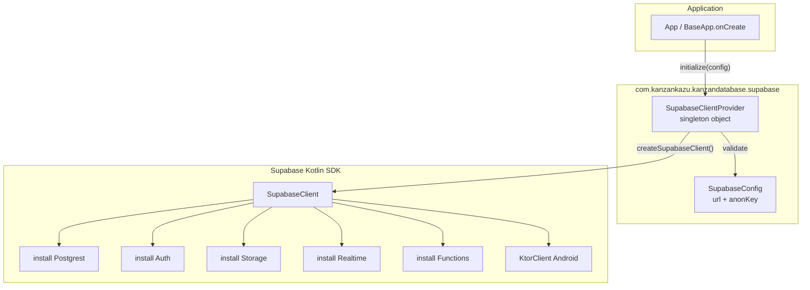

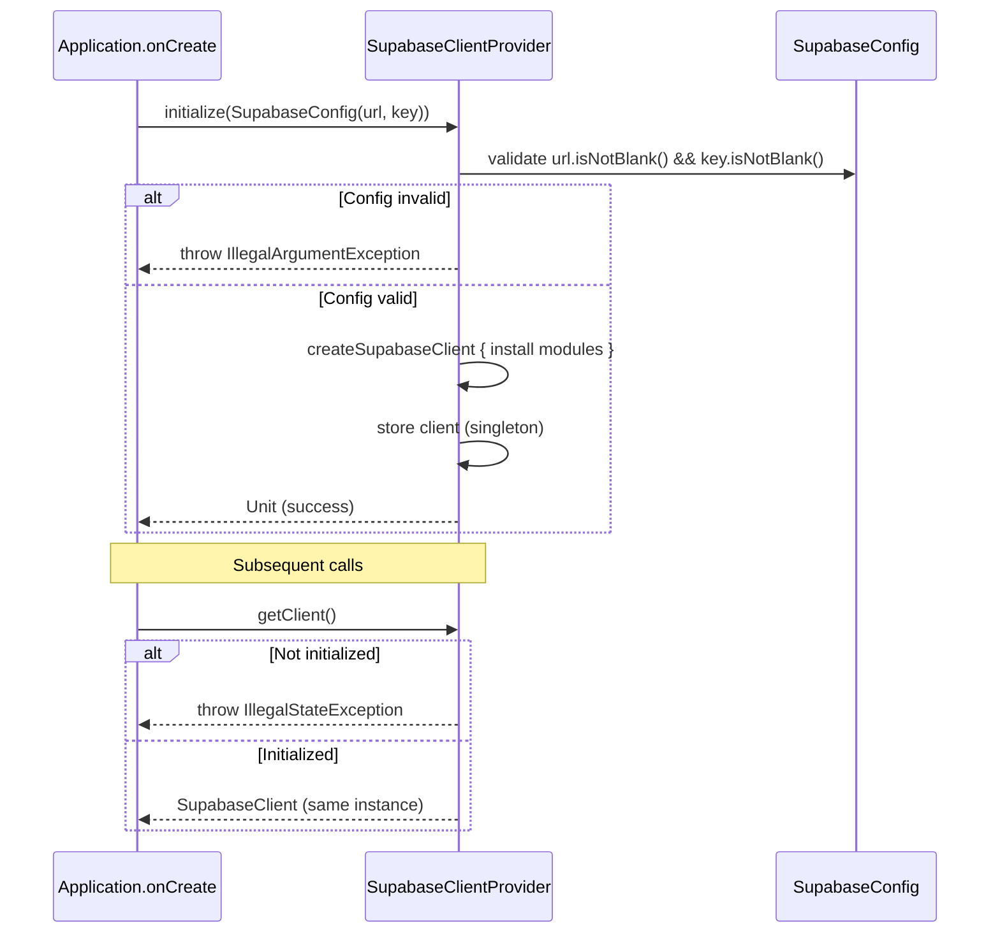

### 2. Database / Postgrest

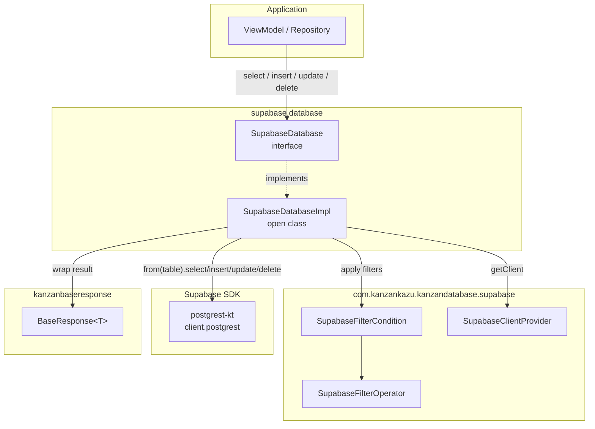

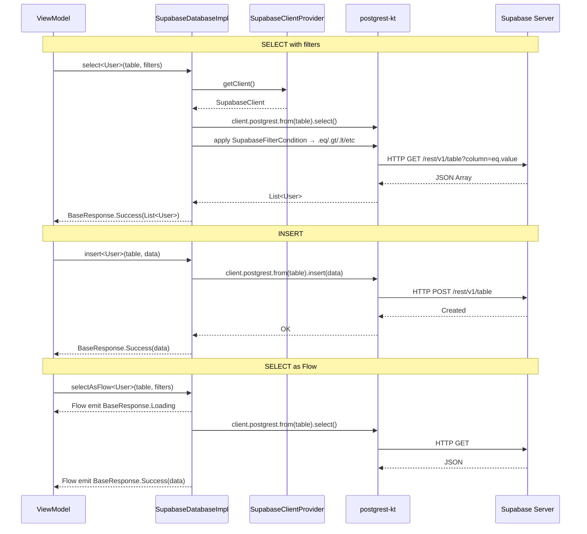

### 3. Authentication

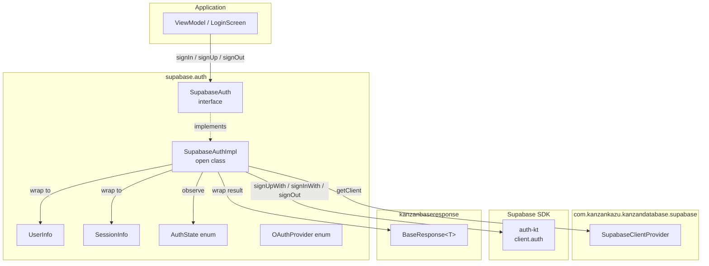

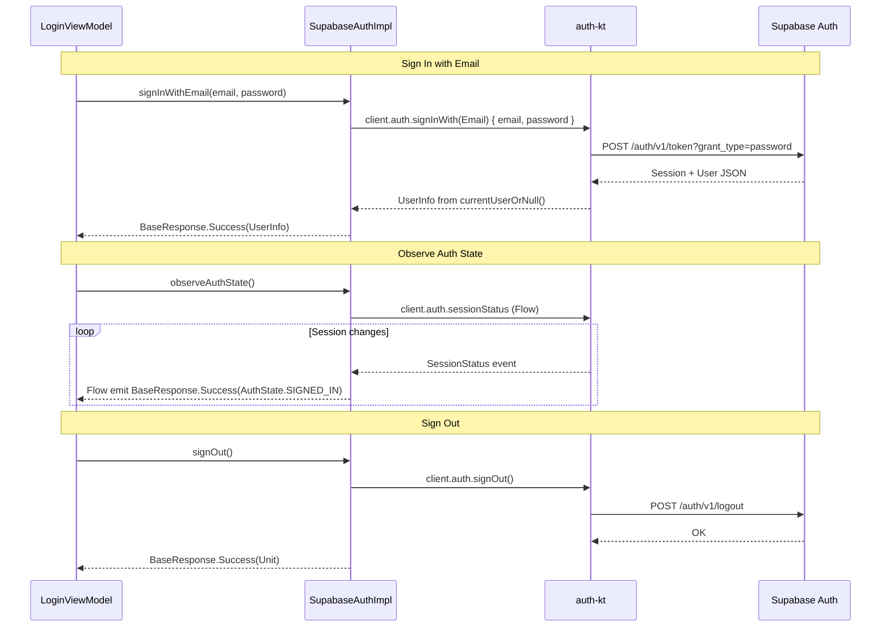

### 4. Storage

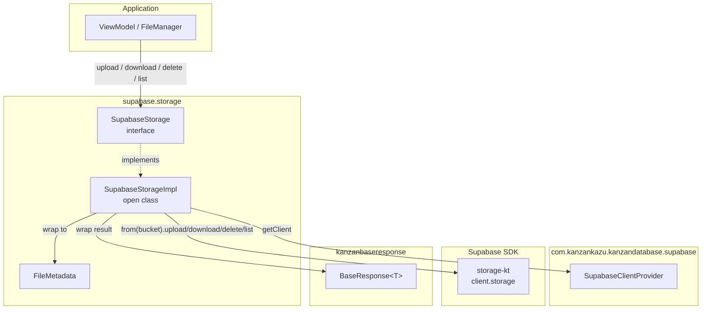

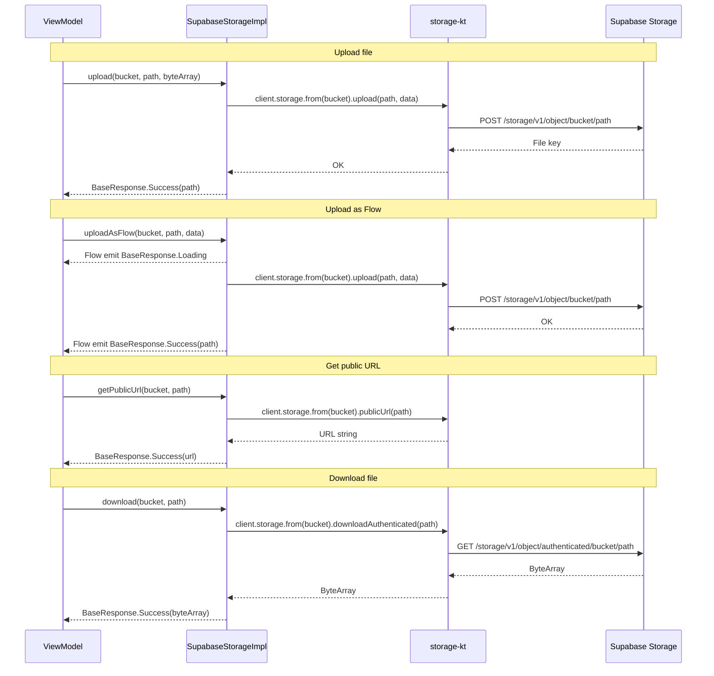

### 5. Realtime

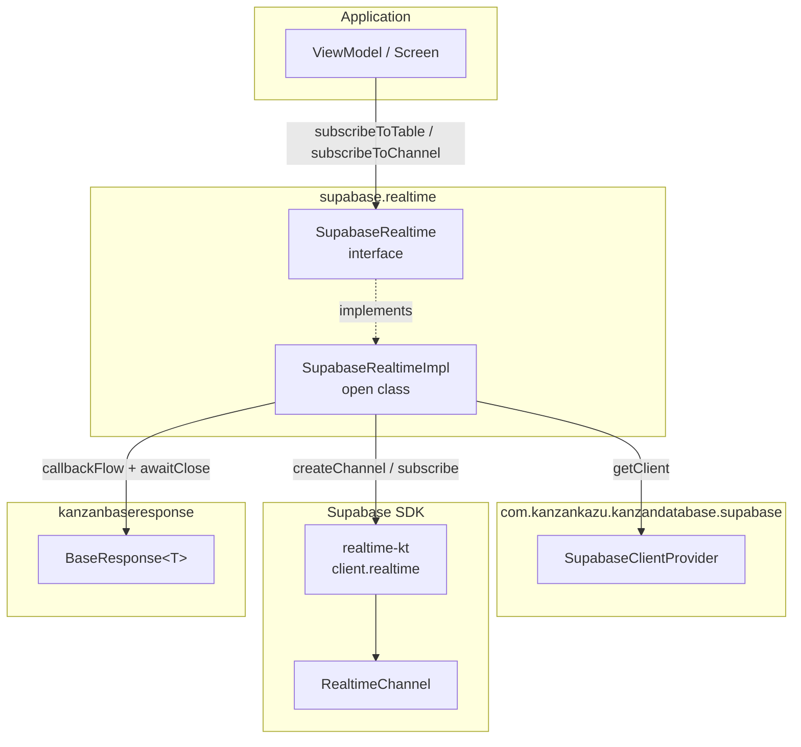

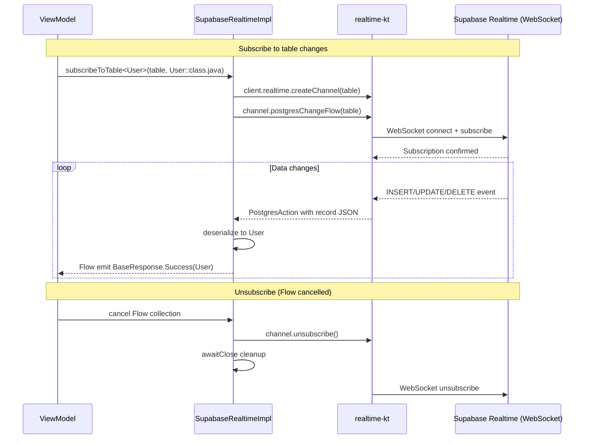

### 6. Edge Functions

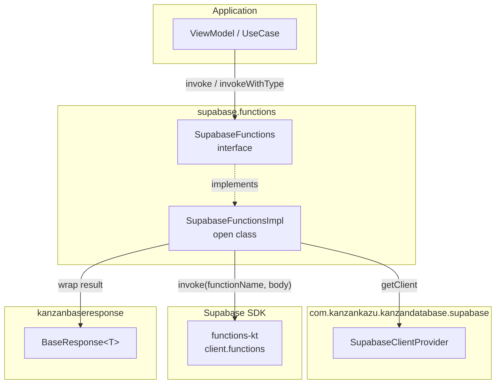

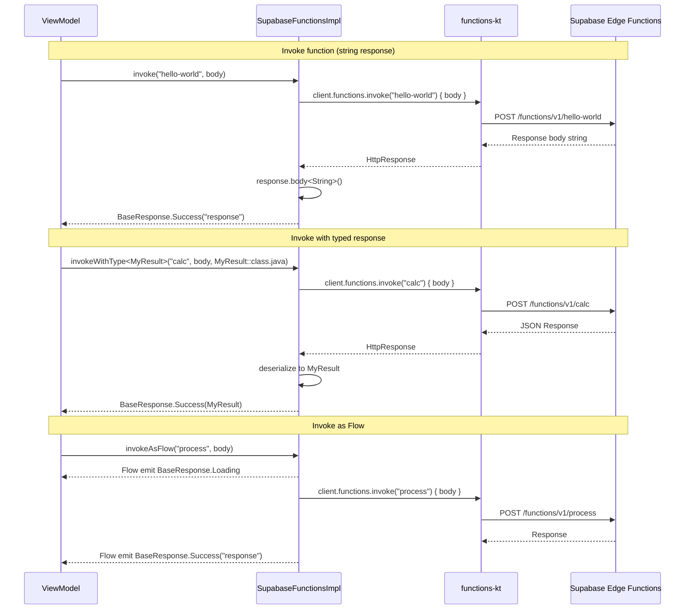

## Components and Interfaces

### 1. SupabaseConfig

Data class sederhana untuk menyimpan konfigurasi koneksi.

```kotlin
data class SupabaseConfig(
    val supabaseUrl: String,
    val supabaseAnonKey: String
)
```

### 2. SupabaseClientProvider

Singleton object yang mengelola lifecycle `SupabaseClient`. Mengikuti pola `FirebaseDatabase.getInstance()`.

```kotlin
object SupabaseClientProvider {
    private var client: SupabaseClient? = null

    fun initialize(config: SupabaseConfig): Unit
    fun getClient(): SupabaseClient
    fun isInitialized(): Boolean
}
```

- `initialize()` — Validasi config (URL/key tidak kosong), buat `SupabaseClient` dengan install semua module (Postgrest, Auth, Storage, Realtime, Functions) dan `KtorClient(Android)`
- `getClient()` — Return client atau throw `IllegalStateException` jika belum di-initialize
- `isInitialized()` — Check apakah client sudah tersedia

### 3. SupabaseDatabase Interface

```kotlin
interface SupabaseDatabase {
    suspend fun <T : Any> insert(table: String, data: T): BaseResponse<T>
    suspend fun <T : Any> upsert(table: String, data: T): BaseResponse<T>
    suspend inline fun <reified T : Any> select(table: String, filters: List<SupabaseFilterCondition> = emptyList()): BaseResponse<List<T>>
    suspend inline fun <reified T : Any> selectById(table: String, column: String, id: Any): BaseResponse<T>
    suspend fun <T : Any> update(table: String, data: T, filters: List<SupabaseFilterCondition>): BaseResponse<T>
    suspend fun delete(table: String, filters: List<SupabaseFilterCondition>): BaseResponse<Unit>
    suspend inline fun <reified T : Any> selectWithPagination(table: String, page: Int, pageSize: Int, filters: List<SupabaseFilterCondition> = emptyList()): BaseResponse<List<T>>
    suspend inline fun <reified T : Any> selectWithOrder(table: String, column: String, ascending: Boolean = true, filters: List<SupabaseFilterCondition> = emptyList()): BaseResponse<List<T>>
    inline fun <reified T : Any> selectAsFlow(table: String, filters: List<SupabaseFilterCondition> = emptyList()): Flow<BaseResponse<List<T>>>
}
```

### 4. SupabaseAuth Interface

```kotlin
interface SupabaseAuth {
    suspend fun signUpWithEmail(email: String, password: String): BaseResponse<UserInfo>
    suspend fun signInWithEmail(email: String, password: String): BaseResponse<UserInfo>
    suspend fun signInWithOAuth(provider: OAuthProvider): BaseResponse<Unit>
    suspend fun signOut(): BaseResponse<Unit>
    suspend fun getCurrentUser(): BaseResponse<UserInfo>
    suspend fun getCurrentSession(): BaseResponse<SessionInfo>
    suspend fun resetPasswordForEmail(email: String): BaseResponse<Unit>
    fun observeAuthState(): Flow<BaseResponse<AuthState>>
}
```

Dimana `UserInfo`, `SessionInfo`, dan `AuthState` adalah data class wrapper:

```kotlin
data class UserInfo(val id: String, val email: String?, val metadata: Map<String, Any?>?)
data class SessionInfo(val accessToken: String, val refreshToken: String, val expiresAt: Long)
enum class AuthState { SIGNED_IN, SIGNED_OUT }
enum class OAuthProvider { GOOGLE, FACEBOOK }
```

### 5. SupabaseStorage Interface

```kotlin
interface SupabaseStorage {
    suspend fun upload(bucket: String, path: String, data: ByteArray): BaseResponse<String>
    suspend fun download(bucket: String, path: String): BaseResponse<ByteArray>
    suspend fun delete(bucket: String, paths: List<String>): BaseResponse<Unit>
    suspend fun getPublicUrl(bucket: String, path: String): BaseResponse<String>
    suspend fun list(bucket: String, prefix: String = ""): BaseResponse<List<FileMetadata>>
    fun uploadAsFlow(bucket: String, path: String, data: ByteArray): Flow<BaseResponse<String>>
}
```

```kotlin
data class FileMetadata(val name: String, val size: Long?, val createdAt: String?, val updatedAt: String?)
```

### 6. SupabaseRealtime Interface

```kotlin
interface SupabaseRealtime {
    fun <T : Any> subscribeToTable(table: String, targetClass: Class<T>): Flow<BaseResponse<T>>
    fun subscribeToChannel(channelName: String): Flow<BaseResponse<String>>
    suspend fun removeSubscription(channelName: String)
    suspend fun removeAllSubscriptions()
}
```

### 7. SupabaseFunctions Interface

```kotlin
interface SupabaseFunctions {
    suspend fun invoke(functionName: String, body: String? = null): BaseResponse<String>
    suspend fun <T : Any> invokeWithType(functionName: String, body: String? = null, targetClass: Class<T>): BaseResponse<T>
    fun invokeAsFlow(functionName: String, body: String? = null): Flow<BaseResponse<String>>
}
```

### 8. SupabaseFilterCondition & SupabaseFilterOperator

```kotlin
data class SupabaseFilterCondition(
    val column: String,
    val value: Any,
    val operator: SupabaseFilterOperator = SupabaseFilterOperator.EQ
)

enum class SupabaseFilterOperator {
    EQ, NEQ, GT, GTE, LT, LTE, LIKE, ILIKE, IN, IS
}
```

### Implementation Pattern

Semua `*Impl` class mengikuti pola yang sama:

```kotlin
open class SupabaseDatabaseImpl(
    private val client: SupabaseClient = SupabaseClientProvider.getClient()
) : SupabaseDatabase {

    override suspend fun <T : Any> insert(table: String, data: T): BaseResponse<T> {
        return try {
            client.postgrest.from(table).insert(data)
            BaseResponse.Success(data)
        } catch (e: Exception) {
            BaseResponse.Error(e.message ?: "Insert failed")
        }
    }
    // ... other operations follow same try/catch → BaseResponse pattern
}
```

Flow-based operations menggunakan `flow { }` builder dengan `onStart { emit(BaseResponse.Loading) }` dan `catch { emit(BaseResponse.Error(...)) }`, konsisten dengan `RealtimeDatabaseImpl.getDataByQueryKanzanBaseResponseFlow()`.

Realtime subscription menggunakan `callbackFlow { }` dengan `awaitClose { }` untuk cleanup, konsisten dengan pattern di `RealtimeDatabaseImpl`.

## Data Models

### Core Data Models

| Model | Package | Deskripsi |
|-------|---------|-----------|
| `SupabaseConfig` | `supabase` | URL + Anon Key configuration |
| `SupabaseFilterCondition` | `supabase` | Column + Value + Operator filter |
| `SupabaseFilterOperator` | `supabase` | Enum: EQ, NEQ, GT, GTE, LT, LTE, LIKE, ILIKE, IN, IS |
| `UserInfo` | `supabase.auth` | User ID, email, metadata wrapper |
| `SessionInfo` | `supabase.auth` | Access token, refresh token, expiry |
| `AuthState` | `supabase.auth` | Enum: SIGNED_IN, SIGNED_OUT |
| `OAuthProvider` | `supabase.auth` | Enum: GOOGLE, FACEBOOK |
| `FileMetadata` | `supabase.storage` | File name, size, timestamps |

### Existing Models (Reused)

| Model | Package | Deskripsi |
|-------|---------|-----------|
| `BaseResponse<T>` | `kanzanbaseresponse` | Loading, Empty, Error, Success sealed interface |

### Package Structure

```
com.kanzankazu.kanzandatabase.supabase/
├── SupabaseConfig.kt
├── SupabaseClientProvider.kt
├── SupabaseFilterCondition.kt
├── SupabaseFilterOperator.kt
├── auth/
│   ├── SupabaseAuth.kt          (interface + data classes)
│   └── SupabaseAuthImpl.kt
├── database/
│   ├── SupabaseDatabase.kt      (interface)
│   └── SupabaseDatabaseImpl.kt
├── storage/
│   ├── SupabaseStorage.kt       (interface + FileMetadata)
│   └── SupabaseStorageImpl.kt
├── realtime/
│   ├── SupabaseRealtime.kt      (interface)
│   └── SupabaseRealtimeImpl.kt
└── functions/
    ├── SupabaseFunctions.kt     (interface)
    └── SupabaseFunctionsImpl.kt
```

### Dependency Configuration (build.gradle additions)

```groovy
// Supabase Kotlin SDK
api platform("io.github.jan-tennert.supabase:bom:2.6.1")
api "io.github.jan-tennert.supabase:postgrest-kt"
api "io.github.jan-tennert.supabase:auth-kt"
api "io.github.jan-tennert.supabase:storage-kt"
api "io.github.jan-tennert.supabase:realtime-kt"
api "io.github.jan-tennert.supabase:functions-kt"

// Ktor HTTP engine for Supabase
api "io.ktor:ktor-client-android:2.3.12"
```


## Correctness Properties

*A property is a characteristic or behavior that should hold true across all valid executions of a system — essentially, a formal statement about what the system should do. Properties serve as the bridge between human-readable specifications and machine-verifiable correctness guarantees.*

### Property 1: Singleton identity — getClient selalu mengembalikan instance yang sama

*For any* number of calls to `SupabaseClientProvider.getClient()` after a successful `initialize()`, all returned `SupabaseClient` instances should be referentially equal (same object reference).

**Validates: Requirements 1.2**

### Property 2: Config validation — empty URL atau Anon Key ditolak

*For any* `SupabaseConfig` where `supabaseUrl` is blank OR `supabaseAnonKey` is blank (including empty string and whitespace-only strings), calling `SupabaseClientProvider.initialize()` should throw `IllegalArgumentException`.

**Validates: Requirements 1.4**

### Property 3: Error wrapping — semua exception di-wrap ke BaseResponse.Error

*For any* Supabase SDK operation (database, auth, storage, realtime, functions) that throws an exception, the corresponding `*Impl` class should catch the exception and return `BaseResponse.Error` with a non-empty message string derived from the exception.

**Validates: Requirements 2.8, 3.7, 4.7, 5.5, 6.4**

### Property 4: Filter operator mapping — semua SupabaseFilterOperator di-translate dengan benar

*For any* `SupabaseFilterCondition` with any valid `SupabaseFilterOperator` (EQ, NEQ, GT, GTE, LT, LTE, LIKE, ILIKE, IN, IS), when applied to a Postgrest query, the filter should be correctly translated to the corresponding Postgrest filter method call. Specifically, for any list of filter conditions, all filters should be applied sequentially to the query.

**Validates: Requirements 2.5, 7.3**

### Property 5: Database CRUD success — operasi valid mengembalikan Success

*For any* valid table name and data object, calling `insert`, `upsert`, `update`, or `delete` on `SupabaseDatabaseImpl` (when the underlying SDK operation succeeds) should return `BaseResponse.Success` containing the appropriate data.

**Validates: Requirements 2.3, 2.6, 2.7, 2.10**

### Property 6: Select with filters returns matching data

*For any* table name, target class, and list of `SupabaseFilterCondition` (including empty list), calling `select` on `SupabaseDatabaseImpl` should return `BaseResponse.Success` containing a `List<T>` where all items match the given filter conditions.

**Validates: Requirements 2.4, 2.5**

### Property 7: Auth operations with valid credentials return Success

*For any* valid email/password combination, calling `signUpWithEmail` or `signInWithEmail` on `SupabaseAuthImpl` (when the underlying SDK operation succeeds) should return `BaseResponse.Success` containing `UserInfo` with a non-empty `id`. Similarly, `getCurrentUser` with an active session should return `BaseResponse.Success` with valid `UserInfo`, and `resetPasswordForEmail` with a valid email should return `BaseResponse.Success`.

**Validates: Requirements 3.2, 3.3, 3.5, 3.9**

### Property 8: Storage operations return Success with correct types

*For any* valid bucket name and file path, when the underlying SDK operation succeeds: `upload` should return `BaseResponse.Success<String>` (file path), `download` should return `BaseResponse.Success<ByteArray>`, `delete` should return `BaseResponse.Success<Unit>`, `getPublicUrl` should return `BaseResponse.Success<String>` (non-empty URL), and `list` should return `BaseResponse.Success<List<FileMetadata>>`.

**Validates: Requirements 4.2, 4.3, 4.4, 4.5, 4.6**

### Property 9: Flow operations emit Loading as first value

*For any* Flow-based operation (`selectAsFlow`, `uploadAsFlow`, `invokeAsFlow`), the first emitted value should always be `BaseResponse.Loading` before any data or error emissions.

**Validates: Requirements 4.8, 6.5**

### Property 10: Realtime subscription emits changes as Success

*For any* table subscription via `subscribeToTable`, when a data change event (INSERT, UPDATE, DELETE) occurs on the subscribed table, the Flow should emit `BaseResponse.Success` containing the changed data deserialized to the target class.

**Validates: Requirements 5.2**

### Property 11: Edge Function invoke returns response string

*For any* valid function name and optional request body, calling `invoke` on `SupabaseFunctionsImpl` (when the underlying SDK operation succeeds) should return `BaseResponse.Success<String>` containing the response body string.

**Validates: Requirements 6.2**

## Error Handling

### Error Handling Strategy

Semua `*Impl` class menggunakan pola `try/catch` yang konsisten:

```kotlin
try {
    // Supabase SDK operation
    BaseResponse.Success(result)
} catch (e: Exception) {
    BaseResponse.Error(e.message ?: "Operation failed")
}
```

### Error Categories

| Error Type | Source | Handling |
|-----------|--------|----------|
| `IllegalStateException` | `SupabaseClientProvider.getClient()` sebelum init | Throw langsung (fail-fast) |
| `IllegalArgumentException` | `SupabaseConfig` dengan URL/key kosong | Throw langsung (fail-fast) |
| Network errors | Ktor HTTP client timeout/connection | Catch → `BaseResponse.Error` |
| Auth errors | Invalid credentials, expired session | Catch → `BaseResponse.Error` |
| Postgrest errors | Invalid query, permission denied | Catch → `BaseResponse.Error` |
| Storage errors | File not found, bucket not found | Catch → `BaseResponse.Error` |
| Realtime errors | Connection lost, channel error | Emit `BaseResponse.Error` via Flow |
| Functions errors | Function not found, timeout | Catch → `BaseResponse.Error` |

### Flow Error Handling

Flow-based operations menggunakan `.catch { emit(BaseResponse.Error(it.message ?: "...")) }` operator, konsisten dengan `RealtimeDatabaseImpl`.

Realtime subscriptions menggunakan `callbackFlow` dengan `awaitClose` untuk resource cleanup saat Flow collection dihentikan.


